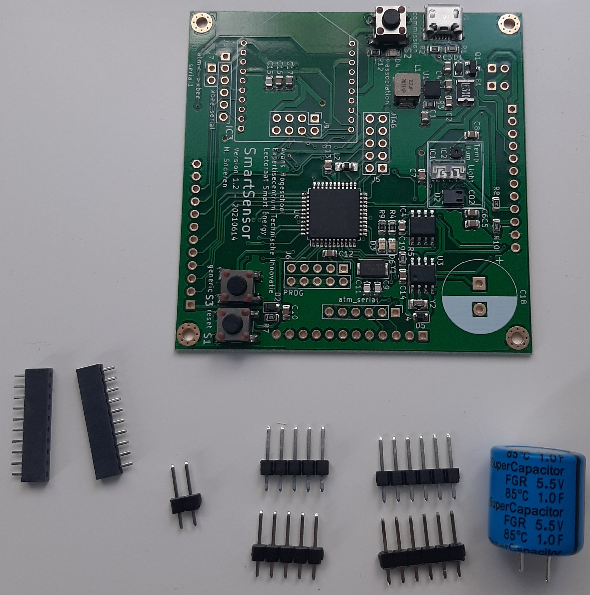
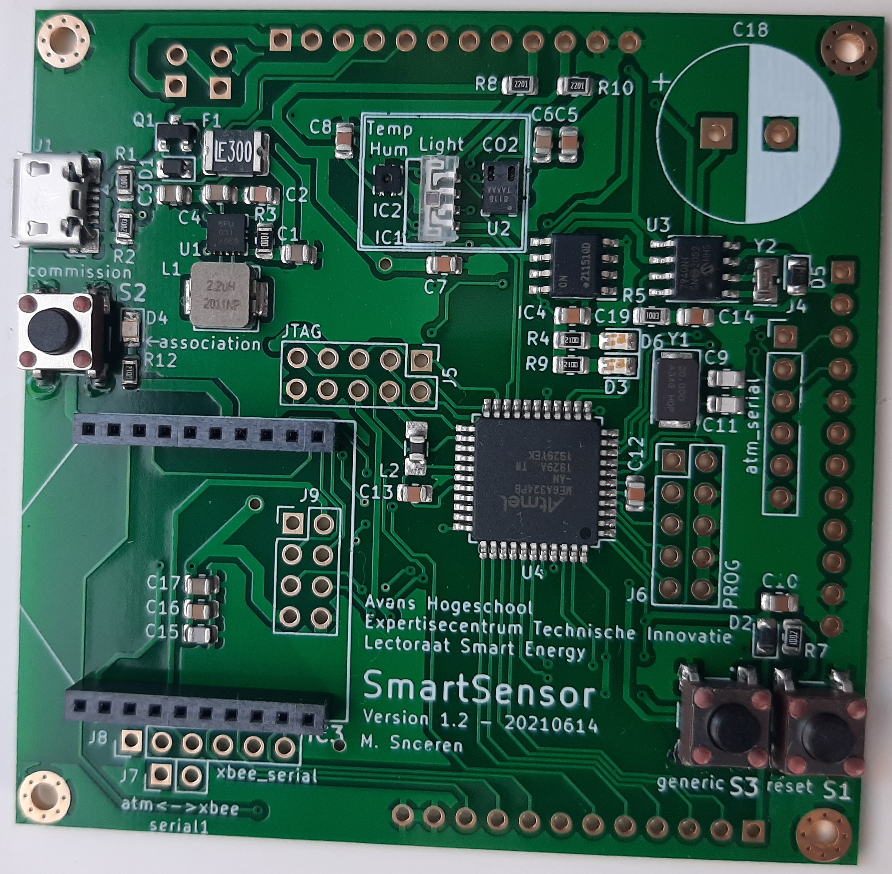
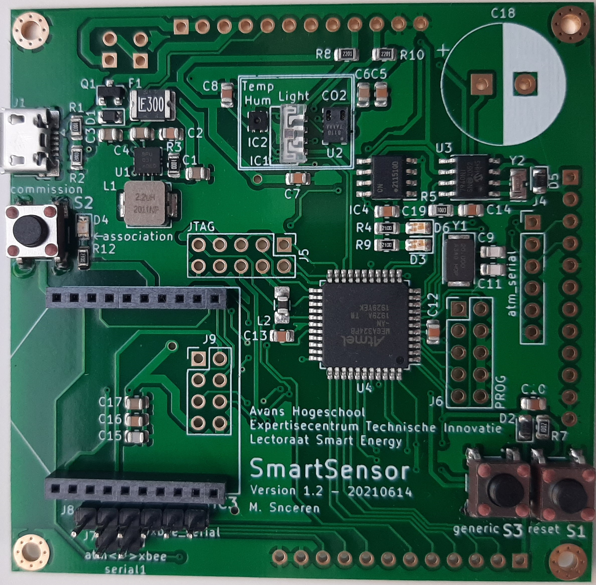
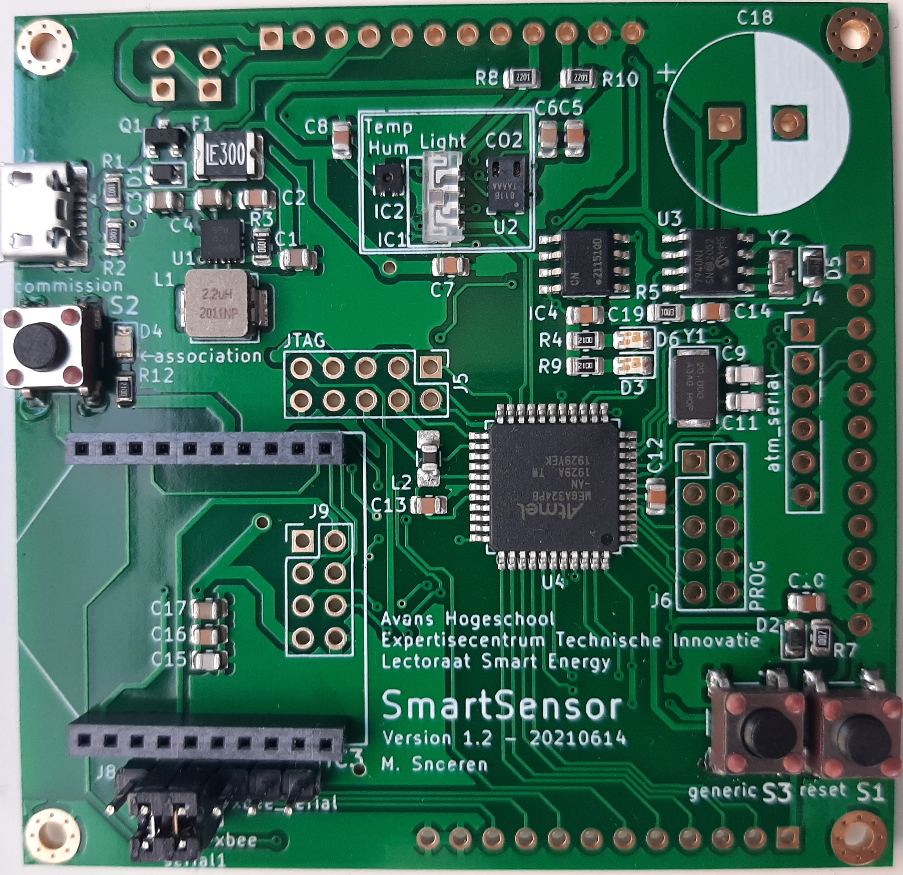
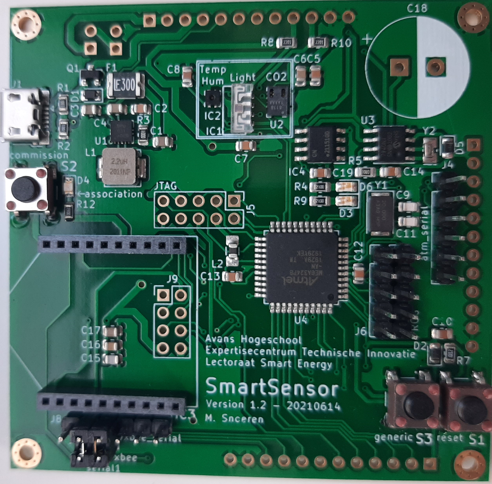
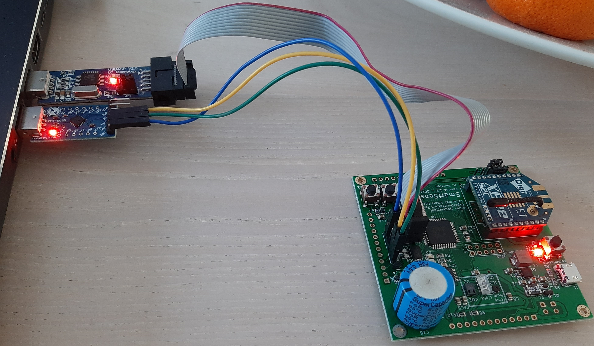
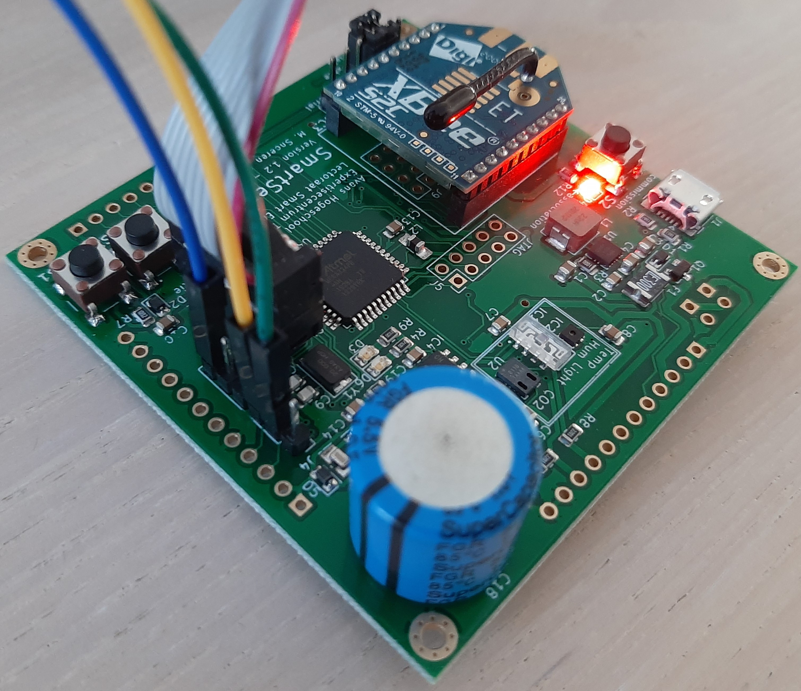
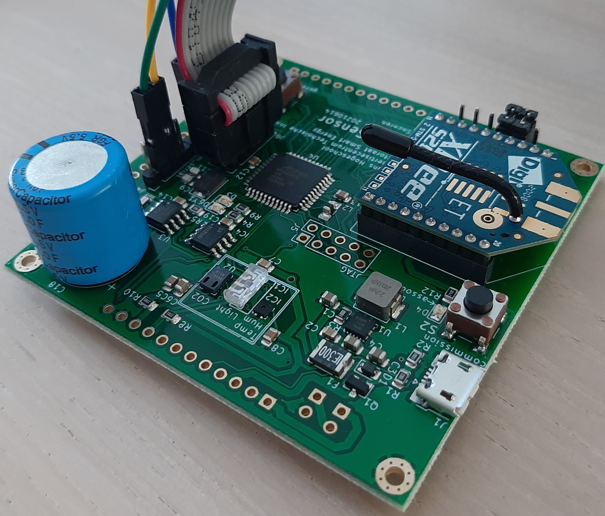

# Soldering SmartSensor v1.2
This tutorial describes all the steps that you need to take to get to a working SmartSensor; or how we call it "SmartNode". 

## Step 1: What do you need
The picture below shows the minimal components you need to get a working SmartSensor: Two 6-pin header, two 5-pin header, one 2-pin header, two zigbee headers and one supercapacitor of 1F. Unfortunately, I forgot two jumpers, XBeeS2CPro and a USB-mini adapter. You need those as well.

## Step 2: Solder zigbee headers
Solder the two zigbee headers (IC3), see the picture below.

## Step 3: Solder headers next to zigbee headers
Solder the 2-pin (J7) and the 6-pin (J8) header next to the zigbee header. 

## Step 4: Place two jumpers
Place two jumpers as shown by the picture to connect the Zigbee with the MCU.

## Step 5: Solder three headers
Solder one 6-pin (J4) and two 5-pin (J6) headers as shown by the picture. These are located at the right side.

## Step 6: Solder the supercap (pay attention!)
Solder the supercapacitor that is place in the top at the right. Make sure that you connect it correctly. The plus is left and the ground is right. Note that if you reverse these, you risk that the supercap will explode!

## Step 7: Place the XBee S2C
Place the XBee on the Zigbee headers. Do this with great care, otherwise the XBee could get damaged.

## Step 8: Connect SmartSensor to the computer
Connect the programmer (USBAsp) and an USB2Serial with the SmartSensor. See the picture below to see how this looks like. In this picture the blue cable is ground (GND), yellow is TX (from computer) and green is RX (to computer).

### Step 8a: Serial connection
The picture shows a detail connection of the serial interface of the SmartSensor. It is connected to the header J4. Pin 2 is MCU TX and need to connected with the RX of the USB2Serial interface (green cable). Pin 3 is MCU RX and need to connected with the TX of the USB2Serial interface (yellow cable). Pin 6 is the ground (GND).

### Step 8b: Programmer connection
Make sure that pin one (red cable) is facing the supercap. The cable connected also has also a lug. Make sure it is facing the MCU (u4)

## Step 9: Program
Use Visual Studio Code with the plugin PlatformIO to upload firmware and bootloader to the SmartSensor. This will be described in another tutorial.